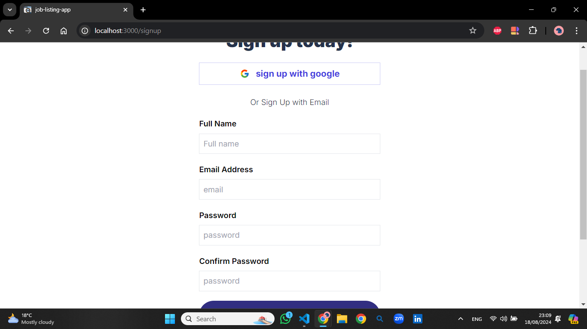
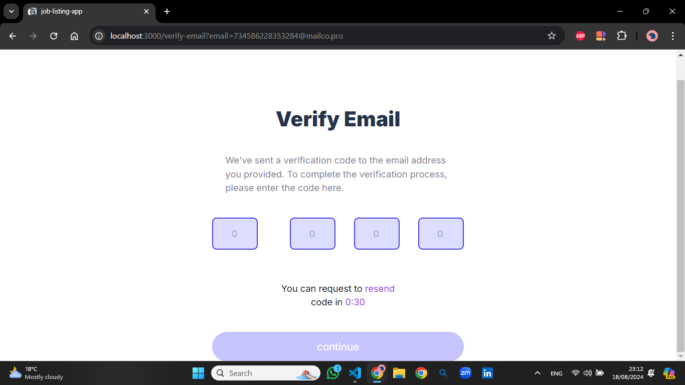
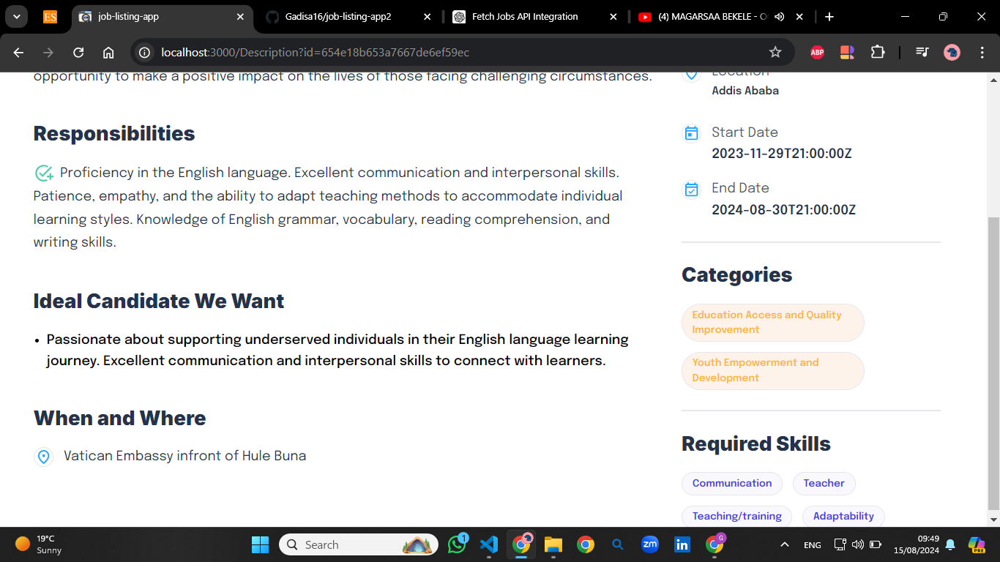
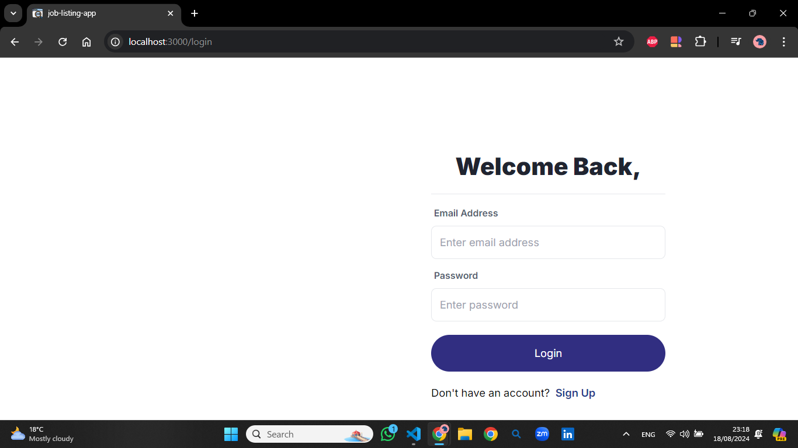

# Job Opportunities Platform

This project is a fully responsive job listing application built with modern web technologies. It enables users to explore job opportunities, register and log in using Google or email, and verify their email during sign-up through OTP verification and sign-out option upon succesfull login.

## Key Features

### User Authentication
- **NextAuth.js Integration**: Supports signing in via Google or email.
- **OTP Verification**: Added security during sign-up with email confirmation.

### Job Listings
- **API Integration**: Job opportunities are fetched from an external API.
- **User Interaction**: Job cards provide a brief overview and a link to detailed job descriptions.

### Responsive Design
- **Seamless Experience**: Fully responsive design ensures compatibility across all devices.

### User-Friendly Interface
- **Accessibility**: A simple and intuitive design for easy navigation and interaction.

## Technologies Used
- **Next.js**: Server-side rendering and static site generation.
- **TypeScript**: Ensures type safety and enhances code quality.
- **Tailwind CSS**: Provides styling and responsive design.
- **NextAuth.js**: Manages user authentication.
- **Redux Toolkit (RTK)**: Manages global state, including job listings and user session data.
- **React Hook Form**: Handles form validation and submission.

## Installation and Setup

1. **Clone the repository:**
   ```bash
   git clone git clone https://github.com/Gadisa16/job-listing-app3.git

2. **install dependencies:**
   npm install

3. **Set up environment variables:**
Create a .env.local file in the root directory and add the following:
      GOOGLE_CLIENT_ID=your_google_client_id
      GOOGLE_CLIENT_SECRET=your_google_client_secret

4. **run the development server**
   npm run dev

### SCREENSHOTS
 # sign-up page
  

 # otp-verification
  

# Landing page or card
 

# Description page
 

# sign-in page
 


## API Endpoints Used
   Signup: /signup
   Sign In: /login
   Verify Email: /verify-email
